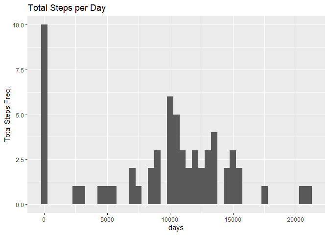
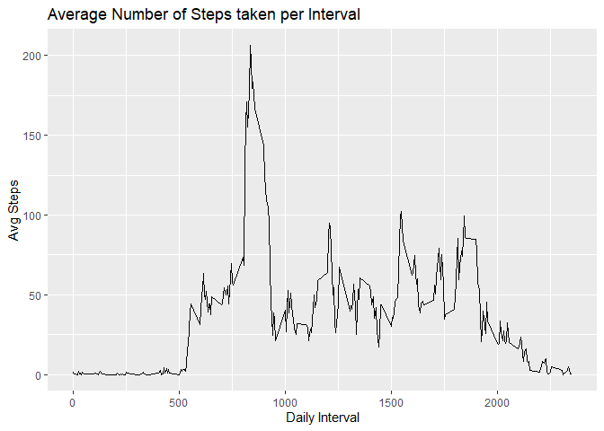
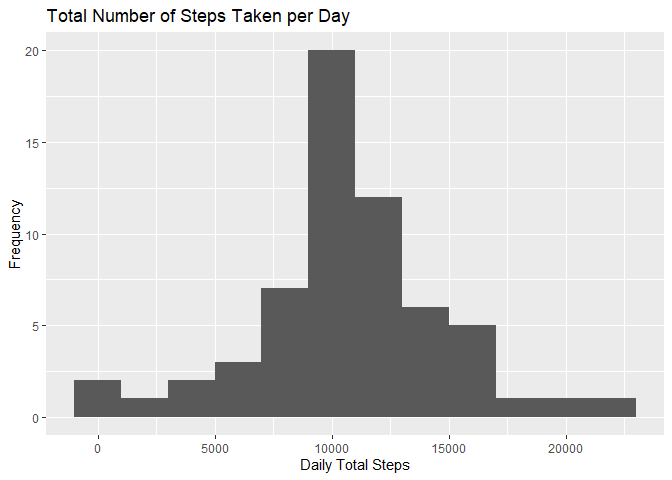
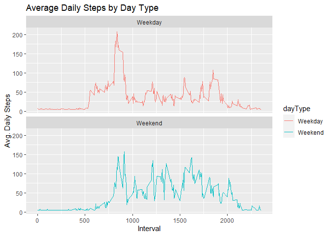

## Assignment Global Settings

```r
library(knitr)
opts_chunk$set(echo=TRUE)
```

## Submission Instructions
1. Code for reading in the dataset and/or processing the data
2. Histogram of the total number of steps taken each day
3. Mean and median number of steps taken each day
4. Time series plot of the average number of steps taken
5. The 5-minute interval that, on average, contains the maximum number of steps
6. Code to describe and show a strategy for imputing missing data
7. Histogram of the total number of steps taken each day after missing values are imputed
8. Panel plot comparing the average number of steps taken per 5-minute interval across weekdays and weekends
9. All of the R code needed to reproduce the results (numbers, plots, etc.) in the report

## Loading and processing the data

**Load the csv file**

```r
library(ggplot2)
library(dplyr)

activity <- read.csv('activity.csv')
```

**Exploring the dataset**

```r
names(activity)
```

```
## [1] "steps"    "date"     "interval"
```

```r
dim(activity)
```

```
## [1] 17568     3
```

```r
str(activity)
```

```
## 'data.frame':	17568 obs. of  3 variables:
##  $ steps   : int  NA NA NA NA NA NA NA NA NA NA ...
##  $ date    : chr  "2012-10-01" "2012-10-01" "2012-10-01" "2012-10-01" ...
##  $ interval: int  0 5 10 15 20 25 30 35 40 45 ...
```

**Transform the dataset for further analysis**

```r
activity$date <- as.Date(activity$date,'%Y-%m-%d')
## verify that we convert the type of date column to 'Date"
class(activity$date)
```

```
## [1] "Date"
```

```r
# dataset overview
summary(activity)
```

```
##      steps             date               interval     
##  Min.   :  0.00   Min.   :2012-10-01   Min.   :   0.0  
##  1st Qu.:  0.00   1st Qu.:2012-10-16   1st Qu.: 588.8  
##  Median :  0.00   Median :2012-10-31   Median :1177.5  
##  Mean   : 37.38   Mean   :2012-10-31   Mean   :1177.5  
##  3rd Qu.: 12.00   3rd Qu.:2012-11-15   3rd Qu.:1766.2  
##  Max.   :806.00   Max.   :2012-11-30   Max.   :2355.0  
##  NA's   :2304
```

## Histogram of the total number of steps taken per day

```r
dailySteps_df<- data.frame(tapply(activity$steps,activity$date,sum,na.rm=T))
dailySteps_df$date<-rownames(dailySteps_df)
names(dailySteps_df)[[1]]<-"Total Steps Daily"
# show preview of the new dataframe with daily steps
head(dailySteps_df)
```

```
##            Total Steps Daily       date
## 2012-10-01                 0 2012-10-01
## 2012-10-02               126 2012-10-02
## 2012-10-03             11352 2012-10-03
## 2012-10-04             12116 2012-10-04
## 2012-10-05             13294 2012-10-05
## 2012-10-06             15420 2012-10-06
```

```r
dailySteps_df$`Total Steps Daily` %>% qplot(xlab = 'days', ylab = 'Total Steps Freq.',binwidth = 500,main = "Total Steps per Day")
```

<!-- -->

## Mean and median number of steps taken each day


```r
mean_val <- mean(dailySteps_df$`Total Steps Daily`)
median_val <- median(dailySteps_df$`Total Steps Daily`)
```

#### Mean: 9354.2295082, Median: 10395


## Time series plot of the average number of steps taken

**Calculate avg steps group by interval and convert as data frame**

```r
avgDailySteps_df <- data.frame(aggregate(activity$steps, by = list(activity$interval), mean, na.rm = T))

names(avgDailySteps_df) <- c("DailyInterval", "AvgSteps")
head(avgDailySteps_df,3)
```

```
##   DailyInterval  AvgSteps
## 1             0 1.7169811
## 2             5 0.3396226
## 3            10 0.1320755
```

**make time series plot**

```r
ts_plot <- ggplot(avgDailySteps_df,aes(`DailyInterval`,`AvgSteps`)) + geom_line() + xlab("Daily Interval")+ylab("Avg Steps")+ggtitle("Average Number of Steps taken per Interval")
ts_plot
```

<!-- -->

## 5-minute interval, on average across all the days in the dataset, contains the maximum number of steps


```r
avgDailySteps_df[which.max(avgDailySteps_df$AvgSteps),][[1]]
```

```
## [1] 835
```

## Imputing Missing Values

**Calculate the total number of missing values in the steps column**

```r
sum(is.na(activity$steps))
```

```
## [1] 2304
```
**Devise a strategy for filling in all of the missing values in the dataset**

```r
# map all missing values to mean in steps column to mean daily steps

steps_filled <- activity$steps
steps_filled[is.na(steps_filled)] <- mean(activity$steps,na.rm = T)
str(steps_filled)
```

```
##  num [1:17568] 37.4 37.4 37.4 37.4 37.4 ...
```

**create a new dataset with non-missing-value steps column**

```r
activity_new <- cbind.data.frame(steps_filled,activity$date,activity$interval)
colnames(activity_new) <- colnames(activity)
head(activity_new,3)
```

```
##     steps       date interval
## 1 37.3826 2012-10-01        0
## 2 37.3826 2012-10-01        5
## 3 37.3826 2012-10-01       10
```
**check if steps column has any missing values**

```r
sum(is.na(activity_new$steps))
```

```
## [1] 0
```

## Histogram of the total number of steps taken each day after missing values are imputed

```r
dailySteps <- tapply(activity_new$steps, activity_new$date,sum)


# Plotting a histogram 
dailySteps %>% qplot(xlab = "Daily Total Steps",ylab = "Frequency", main = "Total Number of Steps Taken per Day",geom = "histogram",binwidth = 2000)
```

<!-- -->
**mean of the total number of daily steps**

```r
mean(dailySteps)
```

```
## [1] 10766.19
```

**median of the total number of daily steps**

```r
median(dailySteps)
```

```
## [1] 10766.19
```

## Panel plot comparing the average number of steps taken per 5-minute interval across weekdays and weekends

**create a factor variable that has two levels - "weekday" and weekend**

```r
activity_new$date <- as.Date(activity_new$date)
activity_new$dayType <- sapply(activity_new$date, function(x){
    if(weekdays(x) == "Saturday" | weekdays(x) == "Sunday"){
        type <- "Weekend"
    }else{
        type <- "Weekday"
    }
    type
})
activity_new$dayType <- factor(activity_new$dayType)
## verify the new column
levels(activity_new$dayType)
```

```
## [1] "Weekday" "Weekend"
```

**make a panel plot**

```r
avgDailySteps_nonNA <- activity_new %>% group_by(interval,dayType)%>% summarize(steps = mean(steps))
```

```
## `summarise()` has grouped output by 'interval'. You can override using the `.groups` argument.
```

```r
head(avgDailySteps_nonNA)
```

```
## # A tibble: 6 x 3
## # Groups:   interval [3]
##   interval dayType steps
##      <int> <fct>   <dbl>
## 1        0 Weekday  7.01
## 2        0 Weekend  4.67
## 3        5 Weekday  5.38
## 4        5 Weekend  4.67
## 5       10 Weekday  5.14
## 6       10 Weekend  4.67
```

```r
panel_p <- ggplot(avgDailySteps_nonNA, aes(x = interval , y = steps, color = dayType)) + 
  geom_line() + ggtitle("Average Daily Steps by Day Type") + 
  xlab("Interval") + 
  ylab("Avg. Daily Steps") +
  facet_wrap(~dayType, ncol = 1, nrow=2)
panel_p
```

<!-- -->
